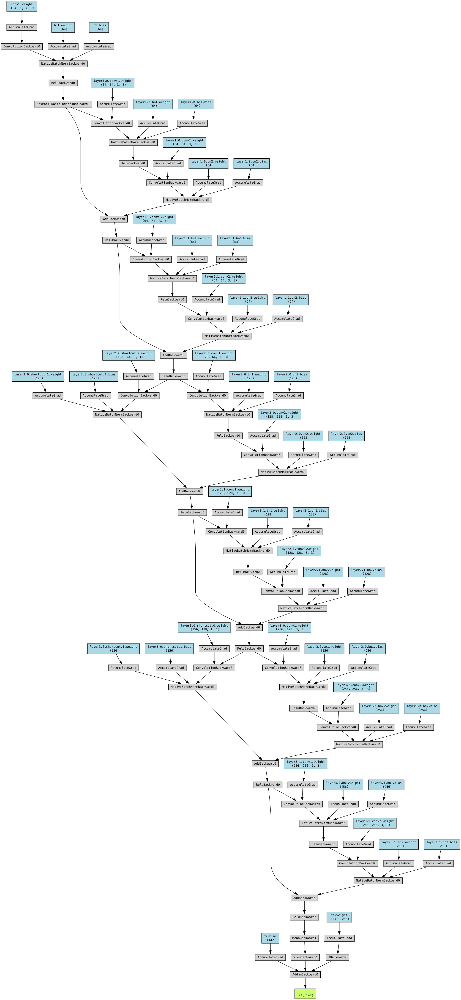

# Thermal Face Recognition
Face Recognition system based on custom ResNet for thermal images, involving the dataset of Visual Pairs provided by SpeakingFaces available at https://github.com/IS2AI/SpeakingFaces.

## DATASET
Download the SpeakingFaces dataset and organize folders as shown below. For each identity we require a different folder. First digits of images name give the ID of the participant.
```python create_subdir.py```
Then we can split the dataset into train-test-val according to 70-20-10, keeping the datafolders organization.
```python split.py```
The organization must be the following.
```
dataset_split/
├── train/
│   ├── 1/
│   │   ├── 1_1_1.png
│   │   └── ...
│   ├── 2/
│   │   ├── 2_1_1.png
│   │   └── ...
│   └── ...
├── test/
│   ├── 1/
│   │   ├── 1_1_9.png
│   │   └── ...
│   ├── 2/
│   │   ├── 2_1_9.png
│   │   └── ...
│   └── ...
└── val/
    ├── 1/
    │   ├── 1_1_17.png
    │   └── ...
    ├── 2/
    │   ├── 2_1_17.png
    │   └── ...
    └── ...
train.py
test_fr.py
split.py
create_subdir.py
best_thermal_model2.pth
```
## HOW TO USE THERMAL MODEL
Run training file train.py or test test_fr.py
### Train
```
python train_fr.py
```
### Test
```
python test_fr.py
```

## NETWORK DETAILS
The implemented neural network is a simplified architecture inspired by ResNet18, composed of an initial convolution layer followed by three residual layers (each layer contains two BasicBlock blocks), each of which learns increasingly abstract representations of input data. The network works on grayscale images sized to 112×112 and uses initial max pooling, followed by Adaptive Average Pooling and a fully connected final for classification into 142 classes.

### Simplification adopted
Compared to the standard ResNet architecture, some simplifications have been adopted to reduce computational complexity and adapt the model to the available dataset. In particular:
- The input images are in grayscale (1 channel) and small in size (112×112 pixels).

- The network uses BasicBlock blocks without a bottleneck architecture, and a limited number of residual blocks (3).

- The output was adapted to 142 classes of SpeakingFaces individuals.

- The data augmentation was kept simple, including only horizontal flips and slight rotations.

These choices allow greater efficiency while maintaining sufficient expressive capacity for the proposed classification task.


Reproducible via summary.py.
```
==========================================================================================
Layer (type:depth-idx)                   Output Shape              Param #
==========================================================================================
CustomResNet                             [32, 142]                 --
├─Conv2d: 1-1                            [32, 64, 56, 56]          3,136
├─BatchNorm2d: 1-2                       [32, 64, 56, 56]          128
├─MaxPool2d: 1-3                         [32, 64, 28, 28]          --
├─Sequential: 1-4                        [32, 64, 28, 28]          --
│    └─BasicBlock: 2-1                   [32, 64, 28, 28]          --
│    │    └─Conv2d: 3-1                  [32, 64, 28, 28]          36,864
│    │    └─BatchNorm2d: 3-2             [32, 64, 28, 28]          128
│    │    └─Conv2d: 3-3                  [32, 64, 28, 28]          36,864
│    │    └─BatchNorm2d: 3-4             [32, 64, 28, 28]          128
│    │    └─Sequential: 3-5              [32, 64, 28, 28]          --
│    └─BasicBlock: 2-2                   [32, 64, 28, 28]          --
│    │    └─Conv2d: 3-6                  [32, 64, 28, 28]          36,864
│    │    └─BatchNorm2d: 3-7             [32, 64, 28, 28]          128
│    │    └─Conv2d: 3-8                  [32, 64, 28, 28]          36,864
│    │    └─BatchNorm2d: 3-9             [32, 64, 28, 28]          128
│    │    └─Sequential: 3-10             [32, 64, 28, 28]          --
├─Sequential: 1-5                        [32, 128, 14, 14]         --
│    └─BasicBlock: 2-3                   [32, 128, 14, 14]         --
│    │    └─Conv2d: 3-11                 [32, 128, 14, 14]         73,728
│    │    └─BatchNorm2d: 3-12            [32, 128, 14, 14]         256
│    │    └─Conv2d: 3-13                 [32, 128, 14, 14]         147,456
│    │    └─BatchNorm2d: 3-14            [32, 128, 14, 14]         256
│    │    └─Sequential: 3-15             [32, 128, 14, 14]         8,448
│    └─BasicBlock: 2-4                   [32, 128, 14, 14]         --
│    │    └─Conv2d: 3-16                 [32, 128, 14, 14]         147,456
│    │    └─BatchNorm2d: 3-17            [32, 128, 14, 14]         256
│    │    └─Conv2d: 3-18                 [32, 128, 14, 14]         147,456
│    │    └─BatchNorm2d: 3-19            [32, 128, 14, 14]         256
│    │    └─Sequential: 3-20             [32, 128, 14, 14]         --
├─Sequential: 1-6                        [32, 256, 7, 7]           --
│    └─BasicBlock: 2-5                   [32, 256, 7, 7]           --
│    │    └─Conv2d: 3-21                 [32, 256, 7, 7]           294,912
│    │    └─BatchNorm2d: 3-22            [32, 256, 7, 7]           512
│    │    └─Conv2d: 3-23                 [32, 256, 7, 7]           589,824
│    │    └─BatchNorm2d: 3-24            [32, 256, 7, 7]           512
│    │    └─Sequential: 3-25             [32, 256, 7, 7]           33,280
│    └─BasicBlock: 2-6                   [32, 256, 7, 7]           --
│    │    └─Conv2d: 3-26                 [32, 256, 7, 7]           589,824
│    │    └─BatchNorm2d: 3-27            [32, 256, 7, 7]           512
│    │    └─Conv2d: 3-28                 [32, 256, 7, 7]           589,824
│    │    └─BatchNorm2d: 3-29            [32, 256, 7, 7]           512
│    │    └─Sequential: 3-30             [32, 256, 7, 7]           --
├─AdaptiveAvgPool2d: 1-7                 [32, 256, 1, 1]           --
├─Linear: 1-8                       [32, 142]                 36,494

```
Auto generated figure of the network.


## NETWORK DETAILS - THERMAL+RGB
The model was then used as a foundation to develop an architecture composed of two separate ResNet branches, trained independently on thermal and RGB visual data, respectively. After feature extraction, the two inputs are fused at the decision level, where their features are combined in the final layer to predict the class label.

## HOW TO USE - THERMAL+RGB MODEL 
Prepare your data and annotations, according to the previous steps then run training file train_fusion.py or test test_fusion.py
### Train
```
python train_fusion.py
```
### Test
```
python test_fusion.py
```


